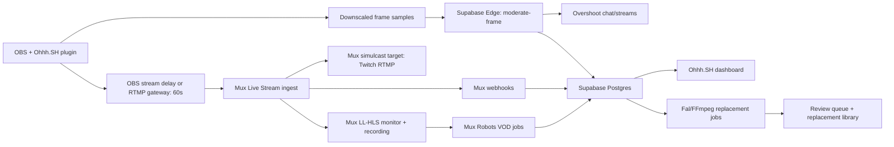

# Ohhh.SH Live Moderation App Spec

Project: Ohhh.SH
Target app repo: `/Users/gratitud3/Downloads/muxskills/osh-app-main`
OBS plugin repo: `/Users/gratitud3/Downloads/muxskills/ohhh-sh-main`
Mux/Overshoot base repo: `/Users/gratitud3/Downloads/muxskills/mux-overshoot-main`
Moderation reference repo: `/Users/gratitud3/Downloads/muxskills/content-moderation-dashboard-main`
Hosted backend: Supabase project `osh` (`pylarlurrffjenwnnyvd`, `us-east-1`)

## Executive Decision

Build Ohhh.SH as a Supabase-backed live moderation operations console, not as a pure browser-only Mux/Overshoot demo.

The only credible way to deliver "sub-1 second latency" is to define it as moderation decision latency from source frame capture to policy decision. Mux low-latency HLS and Twitch RTMP playback cannot provide sub-1 second glass-to-glass latency. Mux low-latency live playback can be around 5 seconds under controlled conditions, and Twitch adds its own platform delay. Therefore:

- OBS is the enforcement point.
- OBS applies local moderation gating before encoded output reaches the public stream path.
- OBS or the RTMP gateway applies the intentional 60 second broadcast delay.
- Mux is the live ingest, playback, recording, simulcast, health, and VOD/audit layer.
- Overshoot is the low-latency visual reasoning path.
- Mux Robots is the post-recording/VOD compliance layer.
- Fal/FFmpeg is an asynchronous replacement and remediation layer, not the primary sub-1 second live blocker.

## Current Repo Findings

### `osh-app-main`

Current shape:

- Vite + React 18 + shadcn/Radix + React Query.
- Supabase auth is already wired through `src/integrations/supabase/client.ts`.
- UI is only auth gate plus a "Welcome" screen in `src/pages/Index.tsx`.
- Database currently has only `public.profiles`.
- Supabase project config points to `pylarlurrffjenwnnyvd`.
- No Edge Functions exist in the hosted project yet.

Use this repo as the target product shell because it already matches Lovable/Supabase hosting.

### `mux-overshoot-main`

Reusable pieces:

- Mux live stream creation flow in `server.mjs`.
- Live resource normalization: stream ID, stream key, playback ID, playback URL, active asset ID, latency mode, reconnect window.
- Video.js HLS player in `src/components/LivePlayer.tsx`.
- Overshoot browser SDK prototype in `src/App.tsx`.

Do not copy the production security model from this repo:

- It uses a Bun server, which does not match the Lovable/Supabase deployment target.
- It exposes `PUBLIC_OVERSHOOT_API_KEY` in browser env for demo purposes.
- It analyzes Mux HLS output, so detection latency includes Mux playback delay.

Port the Mux API behavior into Supabase Edge Functions and keep all Mux, Overshoot, Twitch, and Fal credentials server-side.

### `ohhh-sh-main`

Reusable pieces:

- OBS async video filter in C++.
- Downscales frames to 640x360 before moderation.
- Samples at configurable FPS.
- Uses a local decision snapshot to block frames.
- Supports `blackout` and `hold_last_safe` block modes.
- Current direct Overshoot frame request path is already separated into `OvershootWorker`.

Limitations to preserve in the spec:

- The plugin currently calls `/chat/completions` with base64 JPEGs.
- It does not use Overshoot `/v1/streams` + LiveKit yet.
- Its local raw-frame delay is designed for hundreds of milliseconds, not 60 seconds.
- A 60 second raw-frame buffer at 1080p60 is not acceptable. The 60 second buffer must be encoded stream delay or RTMP gateway delay, not the filter queue.

Required plugin change:

- Keep plugin enforcement delay around 250-750ms.
- Add a server-backed `moderate-frame` mode so untrusted streamers do not need the Overshoot API key locally.
- Add policy sync from the app: sample FPS, threshold, block mode, fail-open/closed, active prompt, stream session token.
- Add telemetry POSTs for moderation events.

### `content-moderation-dashboard-main`

Reusable concepts:

- Mux Robots `moderate` workflow.
- Review/reject thresholds for sexual and violence scores.
- Q&A rules for custom policy.
- Human review queue model.
- Webhook idempotency and event persistence.

Do not copy Convex directly. Port the concepts to Supabase tables, Edge Functions, Realtime, and RLS.

## Target System Architecture



## Latency Budget

Primary target: source-frame-to-policy-decision under 1000ms.

Recommended MVP budget:

- OBS frame capture and downscale: 10-30ms.
- JPEG encode: 5-30ms.
- Request to regional Edge Function or direct Overshoot: 30-150ms.
- Overshoot inference: 200-700ms.
- Decision parse and local action: 5-20ms.
- Local filter buffer: 250-750ms.

Public viewer delay:

- Intentional OBS/RTMP delay: 60 seconds.
- Mux low-latency HLS monitor: additional seconds.
- Twitch platform delay: additional platform-dependent seconds.

This means the viewer sees moderated output, but not sub-1 second output.

## Stream Flow

1. Operator signs in to Ohhh.SH.
2. Operator creates a stream session in the dashboard.
3. Supabase Edge Function creates or reuses a Mux live stream:
   - `latency_mode`: default `low`.
   - `reconnect_window`: explicitly `60` for low/reduced mode.
   - `playback_policies`: start as `signed` for private dashboard preview; use `public` only if product allows.
   - `new_asset_settings.playback_policies`: signed until review completes.
   - `simulcast_targets`: optional Twitch RTMP URL + stream key.
4. App stores `stream_sessions`, Mux IDs, policy ID, and stream status.
5. App returns OBS setup details:
   - Mux RTMPS ingest URL.
   - Mux stream key.
   - OBS delay requirement: `60000ms`.
   - Ohhh.SH plugin session token.
   - Policy configuration.
6. OBS plugin samples frames immediately, before the 60 second output delay reaches Mux/Twitch.
7. Plugin gates frames locally:
   - `allow`: pass frame.
   - `block`: blackout or hold last safe frame.
   - `review`: keep streaming, emit event, optionally switch to slate if confidence crosses operator policy.
8. Plugin posts moderation telemetry to Supabase.
9. App dashboard receives Realtime updates.
10. Mux webhooks update live stream, active asset, and recording lifecycle.
11. When the recording asset becomes ready, run Mux Robots moderation and Q&A.
12. Flagged windows can trigger Fal/FFmpeg replacement jobs for VOD cleanup or highlight generation.

## Policy Model

MVP policy categories:

- `sexual_explicit`
- `graphic_nudity`
- `violence_graphic`
- `self_harm`
- `hate_symbols`
- `weapon_threat`
- `copyright_sports_rebroadcast`
- `brand_safety_custom`

Decision outcomes:

- `allow`: no intervention.
- `review`: visible to moderator, no automatic live block.
- `block`: plugin replaces frame before it enters delayed output.
- `hold`: hold last safe frame.
- `slate`: switch to approved slate/ad scene.
- `end_stream`: operator or automation disables stream.

Default live prompt:

```text
You are a strict live broadcast safety classifier. Classify only visible content in this frame or short clip. Return JSON with decision, categories, confidence, reason, and recommended_action. Block explicit nudity, pornographic content, visible genitals, graphic sexual content, graphic violence, self-harm in progress, hate symbols, or immediate weapon threat. Use review for ambiguous content. Do not block ordinary faces, clothing, fitness, gameplay UI, or non-graphic discussion.
```

Expected JSON:

```json
{
  "decision": "allow | review | block",
  "categories": ["sexual_explicit"],
  "confidence": 0.92,
  "reason": "brief reason",
  "recommended_action": "blackout | hold_last_safe | slate | none"
}
```

## Supabase Data Model

Create migrations in `osh-app-main/supabase/migrations`.

Core tables:

- `profiles`: existing.
- `teams`
- `team_members`
- `stream_sessions`
- `stream_policies`
- `obs_clients`
- `moderation_events`
- `moderation_windows`
- `mux_live_streams`
- `mux_assets`
- `mux_webhook_events`
- `robots_jobs`
- `review_queue_items`
- `review_decisions`
- `fal_jobs`
- `generated_replacements`
- `search_documents`

Suggested minimum schema:

```sql
create type public.stream_status as enum (
  'draft', 'starting', 'live', 'degraded', 'ended', 'failed'
);

create type public.moderation_decision as enum (
  'allow', 'review', 'block'
);

create type public.moderation_action as enum (
  'none', 'blackout', 'hold_last_safe', 'slate', 'end_stream'
);

create table public.stream_policies (
  id uuid primary key default gen_random_uuid(),
  owner_id uuid not null references auth.users(id) on delete cascade,
  name text not null,
  prompt text not null,
  model text not null default 'Qwen/Qwen3.5-9B',
  sample_fps int not null default 4 check (sample_fps between 1 and 10),
  threshold numeric not null default 0.8 check (threshold >= 0 and threshold <= 1),
  block_mode text not null default 'hold_last_safe',
  fail_open boolean not null default false,
  categories jsonb not null default '[]'::jsonb,
  created_at timestamptz not null default now(),
  updated_at timestamptz not null default now()
);

create table public.stream_sessions (
  id uuid primary key default gen_random_uuid(),
  owner_id uuid not null references auth.users(id) on delete cascade,
  policy_id uuid references public.stream_policies(id),
  title text not null,
  status public.stream_status not null default 'draft',
  mux_live_stream_id text,
  mux_playback_id text,
  mux_active_asset_id text,
  mux_latency_mode text not null default 'low',
  mux_reconnect_window int not null default 60,
  twitch_enabled boolean not null default false,
  obs_delay_ms int not null default 60000,
  obs_sample_fps int not null default 4,
  started_at timestamptz,
  ended_at timestamptz,
  created_at timestamptz not null default now(),
  updated_at timestamptz not null default now()
);

create table public.moderation_events (
  id uuid primary key default gen_random_uuid(),
  session_id uuid not null references public.stream_sessions(id) on delete cascade,
  source_ts_ms bigint not null,
  frame_index bigint,
  model text not null,
  decision public.moderation_decision not null,
  action public.moderation_action not null default 'none',
  confidence numeric not null check (confidence >= 0 and confidence <= 1),
  categories text[] not null default '{}',
  reason text,
  latency_ms int,
  raw_result jsonb not null default '{}'::jsonb,
  created_at timestamptz not null default now()
);

create table public.moderation_windows (
  id uuid primary key default gen_random_uuid(),
  session_id uuid not null references public.stream_sessions(id) on delete cascade,
  start_ts_ms bigint not null,
  end_ts_ms bigint,
  highest_confidence numeric not null default 0,
  categories text[] not null default '{}',
  status text not null default 'open',
  created_at timestamptz not null default now(),
  updated_at timestamptz not null default now()
);
```

Indexes:

- `stream_sessions(owner_id, created_at desc)`
- `stream_sessions(status)`
- `moderation_events(session_id, created_at desc)`
- `moderation_events(session_id, decision, created_at desc)`
- `moderation_windows(session_id, status, created_at desc)`
- `mux_assets(mux_asset_id)`
- `robots_jobs(mux_asset_id, workflow, status)`
- FTS index on `search_documents.tsv`
- Optional vector index if embeddings are added later.

RLS:

- Authenticated users can read their own sessions and policies.
- Moderators can read sessions for their team.
- Only service role Edge Functions can insert Mux webhook events, Robots jobs, Fal jobs, and raw moderation telemetry.
- OBS clients authenticate with a session-scoped token to Edge Functions, not with the user JWT.

## Supabase Edge Functions

Implement these functions under `supabase/functions`.

### `create-stream-session`

Purpose:

- Create `stream_sessions`.
- Create Mux live stream.
- Optionally create Twitch simulcast target.
- Return OBS setup payload.

Secrets:

- `MUX_TOKEN_ID`
- `MUX_TOKEN_SECRET`
- `TWITCH_RTMP_URL`
- `TWITCH_STREAM_KEY`

Response shape:

```json
{
  "session_id": "uuid",
  "mux_live_stream_id": "abc",
  "ingest": {
    "rtmps_url": "rtmps://global-live.mux.com:443/app",
    "stream_key": "secret"
  },
  "obs": {
    "delay_ms": 60000,
    "plugin_session_token": "short-lived-token",
    "sample_fps": 4,
    "block_mode": "hold_last_safe"
  },
  "playback": {
    "playback_id": "id",
    "url": "https://stream.mux.com/id.m3u8"
  }
}
```

### `moderate-frame`

Purpose:

- Accept downscaled JPEG frame samples from OBS plugin.
- Verify plugin session token.
- Call Overshoot `/v1/chat/completions` or a persistent stream session.
- Store `moderation_events`.
- Return a gating decision.

Secrets:

- `OVERSHOOT_API_KEY`

Request shape:

```json
{
  "session_id": "uuid",
  "source_ts_ms": 123456,
  "frame_index": 42,
  "image_jpeg_base64": "...",
  "policy_version": "uuid"
}
```

Response shape:

```json
{
  "decision": "allow",
  "action": "none",
  "confidence": 0.04,
  "categories": [],
  "reason": "No policy violation visible",
  "latency_ms": 421
}
```

### `mux-webhook`

Purpose:

- Verify Mux webhook signature.
- Persist all Mux events idempotently.
- Update live stream status, active asset ID, and asset readiness.
- Trigger Mux Robots moderation on `video.asset.ready`.

### `robots-moderate-asset`

Purpose:

- Port the Mux Robots moderation flow from `content-moderation-dashboard-main`.
- Store thresholds, thumbnail scores, max scores, `exceeds_threshold`, units consumed, and errors.
- Create review queue items for `review`/`reject`.

### `fal-replacement-job`

Purpose:

- Given a flagged time window, create asynchronous remediation output.
- For live output, use pre-generated slate/ad assets only.
- For VOD, create replacement clips or masked edits.

Secrets:

- `FAL_KEY`

Recommended Fal endpoint routing:

- Detection/segmentation: `fal-ai/moondream3-preview/detect`, `fal-ai/sam-3/image/embed`.
- Object removal/image fill: `openai/gpt-image-2/edit` or `fal-ai/nano-banana-pro/edit` for stills.
- Video-to-video edit: `fal-ai/kling-video/o3/standard/video-to-video/edit` or Pro for higher quality.
- Background removal: `fal-ai/birefnet/v2/video`.
- Speech transcription: `fal-ai/speech-to-text/turbo/stream` or `fal-ai/wizper`.

Use queued jobs and webhook callbacks. Do not block live gating on Fal video generation.

### `search-index-backfill`

Purpose:

- Build Supasearch over live sessions, recordings, transcripts, moderation labels, review decisions, and generated replacements.
- Add Postgres FTS first; add embeddings after core search works.

## Frontend Product Surface

Replace `src/pages/Index.tsx` with an authenticated operations app.

Primary views:

1. `Live Console`
   - Stream status.
   - Mux playback preview.
   - OBS setup details.
   - Current policy.
   - Last decision.
   - Rolling event feed.
   - Manual actions: slate, hold last safe, end stream.

2. `Policy`
   - Prompt editor.
   - Threshold slider.
   - Sample FPS stepper.
   - Fail-open/fail-closed toggle.
   - Block mode segmented control.
   - Categories checklist.

3. `Review Queue`
   - Flagged windows.
   - Highest confidence.
   - Category labels.
   - Mux timestamp.
   - Preview thumbnail.
   - Approve/reject/escalate buttons.

4. `Recordings`
   - Mux recordings.
   - Robots moderation status.
   - VOD publish gate.
   - Replacement generation status.

5. `Search`
   - Keyword search over titles, labels, reasons, transcripts, and Q&A.
   - Filters by session, category, decision, reviewer, and date.
   - Moment results with time ranges.

6. `Integrations`
   - Mux credential health.
   - Overshoot model readiness.
   - Twitch target status.
   - Fal key health and recent jobs.

UI rules:

- Keep the app operational and dense. No marketing landing page.
- Use shadcn/Radix components already present in the repo.
- Use `lucide-react` icons for action buttons.
- Keep secrets out of client state and logs.

## OBS Plugin Requirements

MVP changes in `ohhh-sh-main`:

- Add `server_mode` boolean.
- Add `moderation_endpoint` setting.
- Add `session_id` setting.
- Add `session_token` password field.
- Add telemetry POST after each decision.
- Parse the new response JSON shape.
- Keep current local direct Overshoot path as `direct_mode` for trusted studio environments.
- Add config fetch on startup and every 15 seconds:
  - `sample_fps`
  - `threshold`
  - `prompt`
  - `block_mode`
  - `fail_open`
- Do not increase the raw frame buffer to 60 seconds.
- Document that the 60 second delay belongs in OBS stream delay or encoded RTMP gateway.

Future plugin work:

- Replace per-frame JPEG requests with an Overshoot stream publisher.
- Use LiveKit/WebRTC publishing into Overshoot `/v1/streams`.
- Query `ovs://streams/{stream_id}?frame_index=-1` or recent `video_url` segments.
- Renew stream lease every 10-20 seconds and recover on expiry.

## Mux Requirements

Use server-side Mux calls only.

Live stream defaults:

```json
{
  "latency_mode": "low",
  "reconnect_window": 60,
  "playback_policies": ["signed"],
  "new_asset_settings": {
    "playback_policies": ["signed"]
  }
}
```

If the dashboard needs a simple MVP preview, public playback is acceptable only in development. Production should use signed playback and short-lived JWTs.

Webhooks to handle:

- `video.live_stream.connected`
- `video.live_stream.recording`
- `video.live_stream.active`
- `video.live_stream.disconnected`
- `video.live_stream.idle`
- `video.asset.ready`
- `video.asset.live_stream_completed`
- Robots job events if configured.

Twitch:

- Prefer Mux simulcast target to Twitch RTMP.
- Store Twitch stream key only in Supabase secrets, not Postgres rows.
- If Mux simulcast is not available in the account, use a server-side RTMP relay/gateway as a later phase.

## Overshoot Requirements

MVP:

- Server-side `moderate-frame` Edge Function calls `POST /v1/chat/completions`.
- Use downscaled JPEG data URLs.
- Keep request timeout under 1500ms.
- Return fail-closed for high-risk production policies, fail-open for local testing.
- List models before production sessions and store selected model/fallback.

Phase 2:

- Create streams with `POST /v1/streams`.
- Publish OBS/browser preview to returned LiveKit room.
- Query latest frame through `ovs://streams/{stream_id}?frame_index=-1`.
- Query recent clips through `ovs://streams/{stream_id}?start_offset_ms=-1000`.
- Keep alive every 10-20 seconds.
- Delete streams when sessions end.

## Fal/FFmpeg Requirements

Do not put Fal video-to-video generation in the critical live path.

Live path:

- Use local blackout, hold-last-safe, slate, or pre-generated ad scene.
- Optionally use FFmpeg for deterministic blur/mosaic if object masks are locally available fast enough.

Post-live/VOD path:

- Extract flagged windows from Mux recording.
- Use FFmpeg to cut clips around `moderation_windows`.
- Use Fal to generate clean replacement clips or ad insertions.
- Use FFmpeg to stitch final review copy.
- Store generated artifacts and review decisions.

## Supasearch Requirements

Index:

- Stream title and metadata.
- Moderation event reasons and categories.
- Review decisions and notes.
- Robots summaries and Q&A.
- Transcript text when available.
- Generated replacement prompt and output metadata.

Search modes:

- Exact filters: date, session, decision, category, status.
- Full-text search: title, reason, transcript, notes.
- Moment search: return time windows and session/asset IDs.
- Future semantic search: embeddings on transcript chunks and event reasons.

## Implementation Plan for Codex

Phase 1: Supabase foundation

- Add database migrations for stream sessions, policies, events, Mux resources, review queue, and jobs.
- Regenerate Supabase TypeScript types.
- Add RLS policies and service-role-only write paths.
- Add Edge Function shared utilities for auth, CORS, Mux, Overshoot, Fal, and JSON errors.

Phase 2: Mux live stream port

- Port `mux-overshoot-main/server.mjs` into `create-stream-session`.
- Add Mux webhook Edge Function.
- Add dashboard stream creation and status UI.
- Add Video.js or native HLS preview component.

Phase 3: Live moderation

- Implement `moderate-frame`.
- Update OBS plugin server mode.
- Store and stream moderation events into dashboard.
- Add manual controls and policy editor.

Phase 4: VOD moderation and review

- Port Mux Robots concepts from `content-moderation-dashboard-main`.
- Add review queue and recording publish gates.
- Add Q&A policy questions.

Phase 5: Fal/FFmpeg remediation

- Add flagged window extraction job model.
- Add Fal replacement job Edge Function.
- Add generated asset review UI.

Phase 6: Search and hardening

- Add Supasearch indexes.
- Add audit logs.
- Add load tests for moderation throughput.
- Add Playwright smoke tests for auth, stream setup, policy edit, event feed, and review queue.

## Acceptance Criteria

Live MVP:

- Authenticated user can create a stream session.
- Mux live stream is created server-side.
- OBS setup payload includes ingest URL/key and 60 second delay requirement.
- OBS plugin can call `moderate-frame` with session token.
- A safe frame returns `allow` under 1000ms p95 in local/studio network tests.
- A test explicit-policy frame returns `block` and plugin applies blackout or hold-last-safe before public egress.
- Dashboard updates event feed through Supabase Realtime.
- Mux webhooks update stream status.
- No Mux, Twitch, Overshoot, Fal, or Supabase service-role secret is exposed to browser code.

VOD/review MVP:

- `video.asset.ready` triggers Mux Robots moderation.
- Robots scores and thresholds are persisted.
- Exceeding assets create review queue items.
- Review decisions are stored separately from raw scores.
- Private/signed playback is enforced until publish approval.

Performance MVP:

- `moderate-frame` p95 latency is under 1000ms for 640x360 JPEGs at 4 FPS per stream.
- OBS stream delay is configured at 60 seconds.
- The app makes clear that public viewer latency is intentionally delayed.

## Open Risks

- Supabase Edge Functions may not be ideal for sustained high-frequency frame ingress at scale. If p95 latency or cost is poor, move `moderate-frame` to a dedicated regional worker while keeping Supabase as state and auth.
- Overshoot `/v1/streams` + LiveKit will likely outperform per-frame JPEG requests, but adds native plugin complexity.
- Fal video-to-video jobs are too slow for live enforcement. Use them for VOD replacement and pre-generated ad/slate assets.
- Mux Robots is asset/job oriented, not live pre-broadcast blocking.
- Raw-frame 60 second buffering in OBS plugin is not viable. Use encoded stream delay.

## Source References Used

- `osh-app-main/src/pages/Index.tsx`
- `osh-app-main/src/integrations/supabase/client.ts`
- `osh-app-main/supabase/migrations/20260501231643_59bf54cc-7737-4787-9d6f-e0675cd4a3b4.sql`
- `mux-overshoot-main/server.mjs`
- `mux-overshoot-main/src/App.tsx`
- `mux-overshoot-main/src/components/LivePlayer.tsx`
- `ohhh-sh-main/src/overshoot-filter.cpp`
- `ohhh-sh-main/src/overshoot-worker.cpp`
- `content-moderation-dashboard-main/convex/schema.ts`
- `content-moderation-dashboard-main/convex/moderationActions.ts`
- Overshoot docs: `https://docs.overshoot.ai/llms.txt`
- Mux docs: `https://www.mux.com/llms.txt`
- Mux live latency docs: `https://www.mux.com/docs/guides/reduce-live-stream-latency`
- Mux Robots moderation docs: `https://www.mux.com/docs/guides/robots-moderate`
- Fal endpoint catalog consulted through local `fal-models-catalog` skill.
